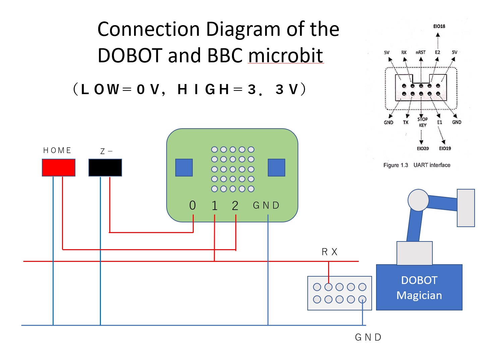

Running DOBOT Magician from BBC Microbit.
=======================

This program is a test to run the robot by issuing DOBOT Magician commands in micropython.

It supports only Clear Alarm, Move to the Home position, and arm movement in the Z direction.

Please add any commands you need.

It does not receive any commands.

## Connection

